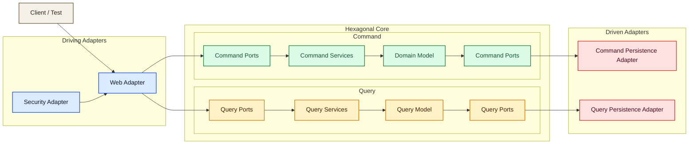
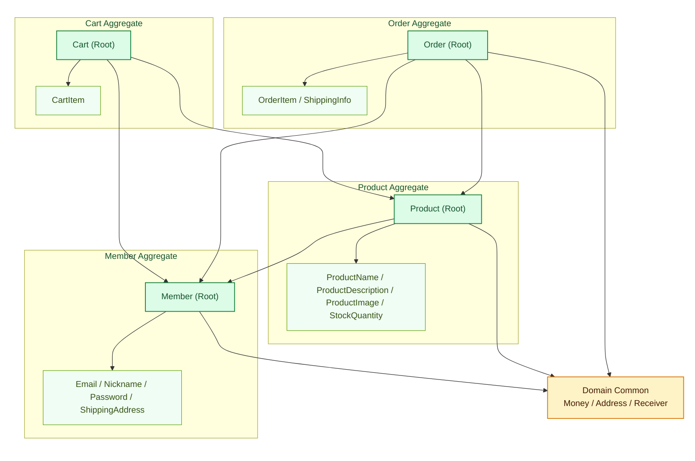

# mallang

이 프로젝트의 주요 목표는 DDD와 TDD를 학습하는 것입니다. 주문과 상품을 비롯한 커머스 도메인을 예시로 삼아, 도메인 모델링과 테스트 중심 개발을 함께 연습합니다.

## 문서

### 도메인 문서

- [Member](./src/main/java/io/mallang/member/README.md)
- [Product](./src/main/java/io/mallang/product/README.md)
- [Cart](./src/main/java/io/mallang/cart/README.md)
- [Order](./src/main/java/io/mallang/order/README.md)
- [Domain Common](./src/main/java/io/mallang/domain/common/README.md)

### API 문서

- [Member API](./src/main/java/io/mallang/member/adapter/web/README.md)
- [Product API](./src/main/java/io/mallang/product/adapter/web/README.md)
- [Cart API](./src/main/java/io/mallang/cart/adapter/web/README.md)
- [Order API](./src/main/java/io/mallang/order/adapter/web/README.md)

## 프로젝트 구조

```text
io.mallang.{domain}
├── domain        # 애그리거트, 엔티티, 값 객체, 도메인 규칙
├── application
│   ├── provided
│   │   ├── command  # 명령 유스케이스 진입 포트
│   │   └── query    # 조회 유스케이스 진입 포트
│   ├── required
│   │   ├── command  # 명령 유스케이스에서 사용하는 외부 의존 포트
│   │   └── query    # 조회 유스케이스에서 사용하는 외부 의존 포트
│   └── service
│       ├── command  # 명령 유스케이스 구현
│       └── query    # 조회 유스케이스 구현
└── adapter
    ├── web
    │   ├── command  # 명령 API 진입 어댑터
    │   └── query    # 조회 API 진입 어댑터
    ├── persistence
    │   ├── command  # 명령 포트를 구현하는 영속성 어댑터
    │   └── query    # 조회 포트를 구현하는 영속성 어댑터
    └── security    # 인증/인가 관련 구현(Member)
```

## 다이어그램

### 전체 구조



### 도메인 관계


