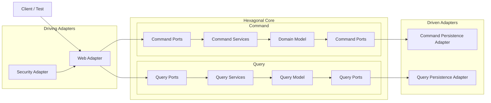
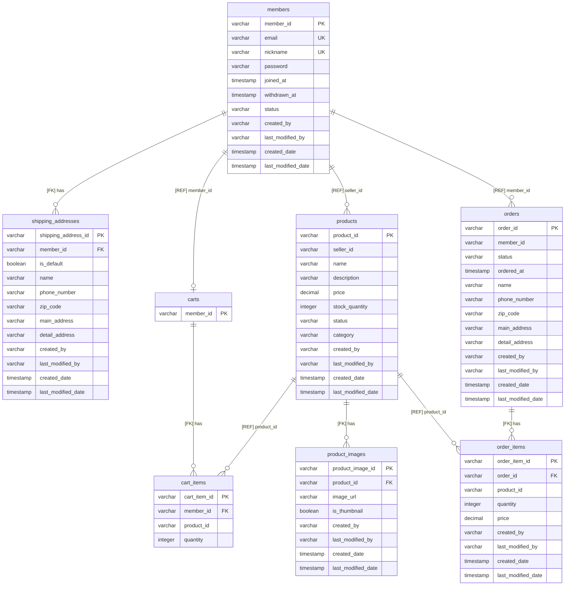
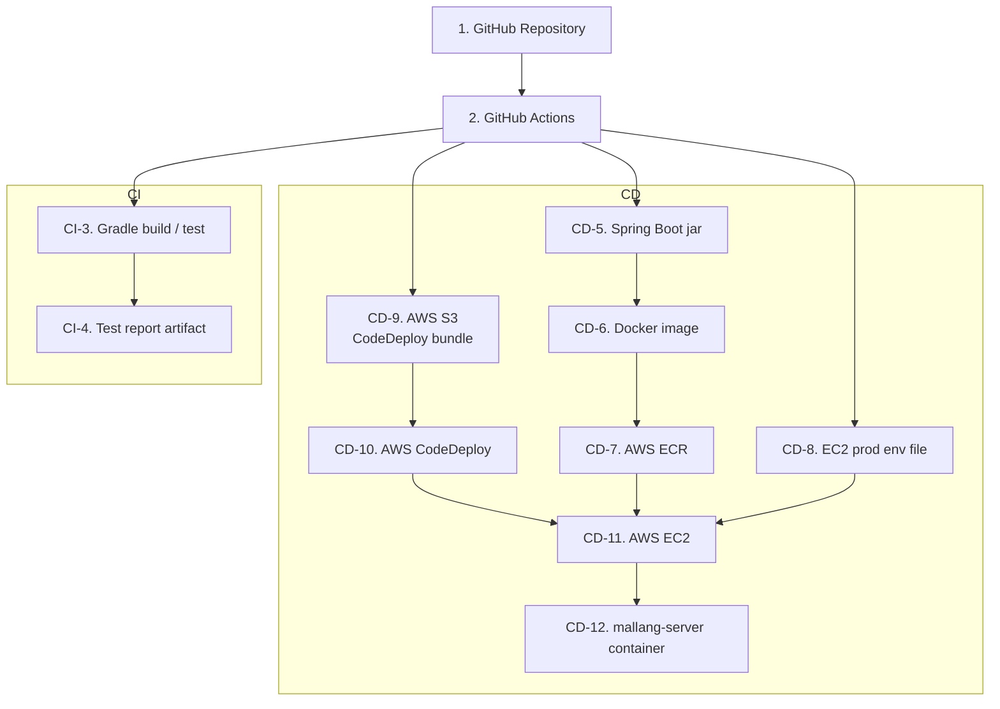

# mallang

이 프로젝트의 주요 목표는 DDD와 TDD를 학습하는 것입니다. 주문과 상품을 비롯한 커머스 도메인을 예시로 삼아, 도메인 모델링과 테스트 중심 개발을 함께 연습합니다.

## 🧰 기술 스택

| 분류              | 기술                                                                        |
|-----------------|---------------------------------------------------------------------------|
| **언어**          | Java 21                                                                   |
| **프레임워크**       | Spring Boot 3.5.11                                                        |
| **Web**         | Spring Web, Bean Validation                                               |
| **보안**          | Spring Security                                                           |
| **영속성**         | Spring Data JPA, MyBatis                                                  |
| **데이터베이스**      | PostgreSQL, H2                                                            |
| **마이그레이션**      | Flyway                                                                    |
| **빌드**          | Gradle Kotlin DSL                                                         |
| **테스트**         | JUnit 5, Spring Boot Test, Spring Security Test, ArchUnit, Testcontainers |
| **로깅 / SQL 추적** | P6Spy                                                                     |
| **로컬 인프라**      | Docker, Docker Compose                                                    |
| **CI/CD**       | GitHub Actions, AWS ECR, S3, CodeDeploy, EC2                              |
| **AI**          | Gemini, Claude, Codex                                                     |

## 🚀 설치 및 실행 방법

```bash
git clone https://github.com/geun-00/mallang.git
cd mallang
```

`spring-boot-docker-compose` 의존성이 설정되어 있어, 개발 환경에서 `bootRun`으로 애플리케이션을 실행할 때 `compose.yaml`을 함께 사용할 수 있습니다.

```bash
./gradlew bootRun
```

Docker Compose를 직접 실행하려면 다음 명령을 사용합니다.

```bash
docker compose up -d
```

## 🏗️ 프로젝트 구조

```text
src/main/java/io/mallang
├── MallangApplication.java
├── common
│   ├── adapter/web        # 전역 예외 처리, 공통 웹 어댑터
│   ├── application        # 공통 애플리케이션 포트/이벤트
│   └── domain             # 공통 값 객체, 도메인 예외
├── member                # 회원 도메인
├── product               # 상품 도메인
├── cart                  # 장바구니 도메인
├── order                 # 주문 도메인
└── security
    ├── adapter            # 인증/보안 어댑터
    └── config             # 보안과 웹 설정
```

도메인은 다음 구조를 따릅니다. 각 도메인은 헥사고날 아키텍처 스타일로 `domain`, `application`, `adapter`를 나누고, `application` 내부에서 유스케이스가 제공 포트와 필요 포트를 통해 외부 의존성과 연결됩니다.

```text
{domain}
├── domain                 # 애그리거트, 엔티티, 값 객체, 도메인 규칙
├── application
│   ├── provided           # 유스케이스 진입 포트
│   ├── required           # 유스케이스가 필요로 하는 외부 의존 포트
│   └── service            # 유스케이스 구현
└── adapter
    ├── web                # REST API 진입 어댑터
    └── persistence        # JPA/MyBatis 영속성 어댑터
```

### 전체 구조



## 📐 프로젝트 규칙

아키텍처 규칙은 ArchUnit 테스트로 검증합니다. 규칙을 바꾸려면 README와 `src/test/java/io/mallang/architecture`의 테스트를 함께 수정합니다.

### 의존성 규칙

- 전체 의존성은 바깥 계층인 `adapter`에서 안쪽 계층인 `application`, `domain` 방향으로 흐릅니다.
- `domain`은 `application`, `adapter`, `security` 패키지를 직접 의존하지 않습니다.
- `domain`은 Spring, JPA, MyBatis, Spring Security, Web 라이브러리를 직접 의존하지 않습니다.
- `domain`에는 `@Service`, `@Repository`, `@Component`, `@RestController` 같은 Spring 계층 어노테이션을 붙이지 않습니다.
- `application.service`와 `application.required`는 `adapter`, `security` 패키지를 직접 의존하지 않습니다.
- `adapter.web`과 `adapter.persistence`는 `application.service` 구현체를 직접 의존하지 않고, 제공 포트나 필요 포트를 통해 연결합니다.
- 상위 패키지 간 순환 의존성을 만들지 않습니다.
- 필드 주입은 사용하지 않습니다.

### 네이밍 규칙

| 대상 | 위치 | 규칙 |
| --- | --- | --- |
| 제공 커맨드 유스케이스 | `application.provided.command` | 인터페이스이며 `UseCase`로 끝납니다. |
| 제공 쿼리 유스케이스 | `application.provided.query` | 인터페이스이며 `UseCase`로 끝납니다. |
| 필요 커맨드 포트 | `application.required.command` | 인터페이스이며 `Port`로 끝납니다. |
| 필요 쿼리 포트 | `application.required.query` | 인터페이스이며 `Port`로 끝납니다. |
| 커맨드 서비스 | `application.service.command` | `CommandService`로 끝납니다. |
| 쿼리 서비스 | `application.service.query` | `QueryService`로 끝납니다. |
| 웹 어댑터 | `adapter.web` | 최상위 클래스는 `Api`로 끝나고 `@RestController`를 사용합니다. |
| 영속성 어댑터 | `adapter.persistence.*` | `@Repository` 구현체는 `PersistenceAdapter`로 끝납니다. |
| JPA 리포지토리 | `adapter.persistence.jpa` | 인터페이스이며 `Repository`로 끝납니다. |

### 구현 규칙

- 애플리케이션 서비스는 `@Service`를 사용하고, `application.provided` 패키지의 `UseCase` 인터페이스를 구현합니다.
- 웹 어댑터는 `UseCase` 인터페이스에 의존합니다. 단, 인증과 CSRF처럼 보안 흐름 자체를 다루는 API는 예외입니다.
- 웹 어댑터의 클래스 레벨 `@RequestMapping` 경로는 `/api/v<버전>` 형식으로 시작합니다.
- 영속성 어댑터 구현체는 `application.required` 포트에 의존합니다.

## 🗃️ ERD

관계 라벨의 `[FK]`는 DB 외래 키로 관리되는 내부 애그리거트 **직접 참조**이고, `[REF]`는 값으로만 식별자를 보관하는 외부 애그리거트 **간접 참조**입니다.



## 🧪 테스트 실행 방법

전체 테스트는 다음 명령으로 실행합니다.

```bash
./gradlew test
```

특정 테스트 클래스만 실행하려면 `--tests` 옵션을 사용합니다.

```bash
./gradlew test --tests "io.mallang.test.security.adapter.web.AuthApiTest"
```

## 🔄 CI/CD 플로우



워크플로 파일은 역할별로 분리되어 있습니다. `.github/workflows/gradle.yml`은 PR과 `main` push 검증을 담당하고, `.github/workflows/deploy.yml`은 `main` push와 수동 실행 배포를 담당합니다.

## 🔐 환경 변수

### application.yml

```dotenv
SPRING_PROFILES_ACTIVE=prod
DB_URL=your_postgresql_url
DB_USERNAME=your_db_username
DB_PASSWORD=your_db_password
```

### GitHub Repository Secrets

```dotenv
AWS_ACCESS_KEY_ID=your_aws_access_key_id
AWS_SECRET_ACCESS_KEY=your_aws_secret_access_key
EC2_HOST=your_ec2_host
EC2_USERNAME=your_ec2_username
EC2_SSH_KEY=your_ec2_ssh_private_key
PROD_ENV_FILE=your_prod_env_file
```

## 📚 기타 문서

### 도메인 문서

- [Member](./src/main/java/io/mallang/member/README.md)
- [Product](./src/main/java/io/mallang/product/README.md)
- [Cart](./src/main/java/io/mallang/cart/README.md)
- [Order](./src/main/java/io/mallang/order/README.md)
- [Domain Common](./src/main/java/io/mallang/common/domain/README.md)

### API 문서

- [Auth API](./src/main/java/io/mallang/security/adapter/web/README.md)
- [Member API](./src/main/java/io/mallang/member/adapter/web/README.md)
- [Product API](./src/main/java/io/mallang/product/adapter/web/README.md)
- [Cart API](./src/main/java/io/mallang/cart/adapter/web/README.md)
- [Order API](./src/main/java/io/mallang/order/adapter/web/README.md)
